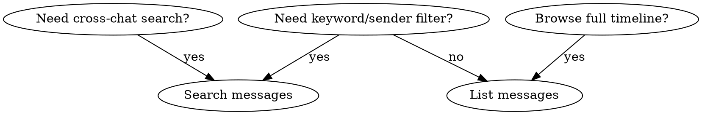

# Lark Chat History

Query Feishu/Lark group chat message history via `lark-cli im`.

## Get chat_id

The current group's chat_id is always extracted from `CC_SESSION_KEY`:

```bash
CHAT_ID=$(echo "$CC_SESSION_KEY" | cut -d: -f2)
```

`CC_SESSION_KEY` format: `feishu:<chat_id>:<user_id>`. If the variable is missing, ask the user for the chat_id.

## Quick Reference

| Goal | Command |
|------|---------|
| Recent messages | `lark-cli im +chat-messages-list --chat-id "$CHAT_ID" --sort desc --page-size 20 --format pretty` |
| Time range | `lark-cli im +chat-messages-list --chat-id "$CHAT_ID" --start "$START" --end "$END" --sort asc --page-size 50 --format pretty` |
| Search by keyword | `lark-cli im +messages-search --query "KEYWORD" --chat-id "$CHAT_ID" --start "$START" --end "$END" --page-all --format pretty` |
| Cross-chat keyword search | `lark-cli im +messages-search --query "KEYWORD" --start "$START" --page-all --format pretty` |

## Time Format

**Always include timezone offset.** Feishu servers use UTC; without offset, timestamps default to UTC and results will be wrong.

```
--start "2026-06-29T00:00:00+08:00"
--end   "2026-06-30T00:00:00+08:00"
```

Common time range patterns:

```bash
# Yesterday
START=$(date -d "yesterday 00:00" +"%Y-%m-%dT%H:%M:%S%z" | sed 's/..$/:&/')  # e.g. 2026-06-29T00:00:00+08:00
END=$(date +"%Y-%m-%dT%H:%M:%S%z" | sed 's/..$/:&/')
```

## Which Command to Use

**`+chat-messages-list`** — Browse all messages in one chat. Includes system messages (joins/leaves). Use when you want the full conversation timeline.

**`+messages-search`** — Filter by keyword, sender, or attachment type. User identity only (no `--as bot`). Supports `--page-all` for auto-pagination. Excludes system messages.



## Common Patterns

### Yesterday's messages

```bash
CHAT_ID=$(echo "$CC_SESSION_KEY" | cut -d: -f2)
START=$(date -d "yesterday 00:00" +"%Y-%m-%dT%H:%M:%S%z" | sed 's/..$/:&/')
END=$(date +"%Y-%m-%dT%H:%M:%S%z" | sed 's/..$/:&/')
lark-cli im +chat-messages-list \
  --chat-id "$CHAT_ID" \
  --start "$START" --end "$END" \
  --sort asc --page-size 50 --format pretty
```

### Search for a keyword in the current group

```bash
CHAT_ID=$(echo "$CC_SESSION_KEY" | cut -d: -f2)
lark-cli im +messages-search \
  --query "deploy" \
  --chat-id "$CHAT_ID" \
  --start "2026-06-28T00:00:00+08:00" \
  --page-all --format pretty
```

### Get full message content

`--format pretty` truncates card (interactive) messages. For full content:

```bash
CHAT_ID=$(echo "$CC_SESSION_KEY" | cut -d: -f2)
lark-cli im +chat-messages-list \
  --chat-id "$CHAT_ID" --sort desc --page-size 5 \
  --format json | jq '.data.messages[] | {content, sender}'
```

### Paginate through history

`+chat-messages-list` does not support `--page-all`. Use `--page-token` manually:

```bash
# First page
lark-cli im +chat-messages-list --chat-id "$CHAT_ID" --sort desc --page-size 50 --format pretty
# → returns page_token in output; use it for next page
lark-cli im +chat-messages-list --chat-id "$CHAT_ID" --sort desc --page-size 50 --page-token "TOKEN" --format pretty
```

## Common Mistakes

| Mistake | Fix |
|---------|-----|
| Forgetting timezone offset | Always append `+08:00` (or your local offset) to ISO 8601 timestamps |
| Using `--format pretty` for detailed analysis | Switch to `--format json` + `jq` for full content |
| Expecting `--page-all` on `+chat-messages-list` | Only available on `+messages-search`; for list, use `--page-token` manually |
| Using bot identity for search | `+messages-search` is user-only; use `+chat-messages-list` with `--as bot` if needed |
| Searching by wrong time range | Feishu messages use the message creation time; edits don't change it |
